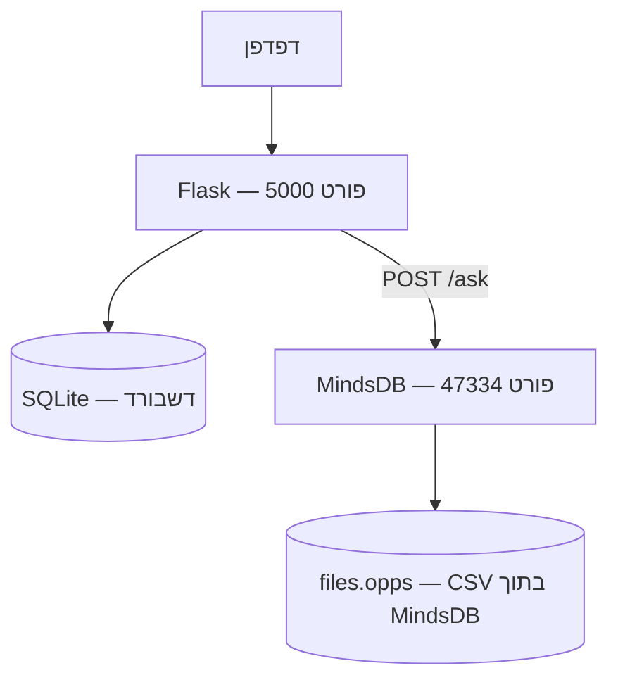

# open-source-analysis
<div dir="rtl">

מערכת לניתוח מאמרי קוד פתוח:
- דשבורד Flask עם גרפים וענן תגיות
- מסד נתונים SQLite לדשבורד (נבנה אוטומטית מ-CSV)
- צ'אט AI דרך MindsDB Agent עם OpenRouter (ללא MySQL)

## ארכיטקטורה



## מבנה הפרויקט

- `src/app.py` — שרת Flask, דשבורד ונתיב `/ask`
- `src/load_data.py` — טעינת `data/opps.csv` אל SQLite
- `src/processor.py` — חישוב מילות מפתח לענן תגיות
- `src/templates/dashboard.html` — תבנית הדשבורד
- `src/static/` — קבצי CSS ו-JavaScript

## הרצה

### אפשרות 1: Docker (מומלץ — כולל MindsDB)

```powershell
docker compose up --build
```

כתובות:
- דשבורד: http://localhost:5000
- MindsDB UI: http://localhost:47334

עצירה:

```powershell
docker compose down
```

### אפשרות 2: הרצה מקומית (דשבורד בלבד, ללא AI)

```powershell
python -m venv .venv
.\.venv\Scripts\Activate.ps1
pip install -r requirements.txt
python src/app.py
```

דשבורד: http://localhost:5000

---

## הגדרת MindsDB ידנית (פעם אחת דרך ה-UI)

לאחר `docker compose up`, כל ההגדרות מתבצעות דרך **MindsDB UI** בכתובת http://localhost:47334.

### שלב 1: טעינת קובץ ה-CSV ל-MindsDB

ב-MindsDB UI לחץ על **Add Data** → **Files** → העלה את הקובץ `data/opps.csv` ותן לו את השם `opps`.

לאחר ההעלאה, מקור הנתונים יהיה `files.opps`.

### שלב 2: יצירת Agent עם OpenRouter (דרך provider=openai)

ב-SQL Editor של MindsDB הרץ:

```sql
CREATE AGENT articles_agent
USING
model = {
  "provider": "openai",
  "model_name": "openrouter/free",
  "api_key": "YOUR_OPENROUTER_API_KEY",
  "base_url": "https://openrouter.ai/api/v1"
},
data = {
  "tables": ["files.opps"]
},
prompt_template = 'You are an analyst for open-source vulnerability articles. Use only facts from files.opps. If the data does not contain the answer, say that clearly.';
```

החלף `YOUR_OPENROUTER_API_KEY` במפתח OpenRouter API שלך.

אם ה-Agent כבר קיים, אפשר לעדכן אותו במקום ליצור מחדש:

```sql
ALTER AGENT articles_agent
USING
model = {
  "provider": "openai",
  "model_name": "openrouter/free",
  "api_key": "YOUR_OPENROUTER_API_KEY",
  "base_url": "https://openrouter.ai/api/v1"
};
```

הערות חשובות:
- `https://openrouter.ai/api/v1` הוא Base URL (לא דף דפדפן).
- כדי לראות מודלים זמינים, השתמש ב-`GET https://openrouter.ai/api/v1/models`.
- אם מודל חינמי מסוים עמוס, ניתן להחליף ל-slug ספציפי כמו `openai/gpt-oss-20b:free`.

### שלב 3: בדיקה

ב-SQL Editor:

```sql
SELECT answer
FROM articles_agent
WHERE question = 'How many articles are in files.opps?';
```

אם מתקבלת תשובה, הצ'אט בדשבורד יעבוד.

---

## משתני סביבה

מומלץ (לא חובה) ליצור קובץ `.env` מתוך `.env.example`:

```powershell
copy .env.example .env
```

| משתנה | ברירת מחדל | תיאור |
|---|---|---|
| `MINDSDB_URL` | `http://mindsdb:47334` | כתובת MindsDB (בתוך Docker) |
| `MINDSDB_AGENT_NAME` | `articles_agent` | שם ה-Agent ב-MindsDB |

## פתרון בעיות

| בעיה | פתרון |
|---|---|
| שגיאת חיבור ל-MindsDB | ודא ש-MindsDB רץ: `docker compose logs mindsdb` |
| Agent לא קיים | ודא שיצרת את `articles_agent` ב-UI |
| תשובה ריקה | בדוק שה-Agent מחזיר שדה `answer` |
| CSV לא נמצא ב-MindsDB | ודא שהעלית את הקובץ ל-`files.opps` |
| `401` מ-OpenRouter | בדוק שמפתח `YOUR_OPENROUTER_API_KEY` תקין ולא פג |
| `404` מ-OpenRouter | ודא ש-`model_name` הוא slug אמיתי מתוך `/api/v1/models` ולא placeholder |